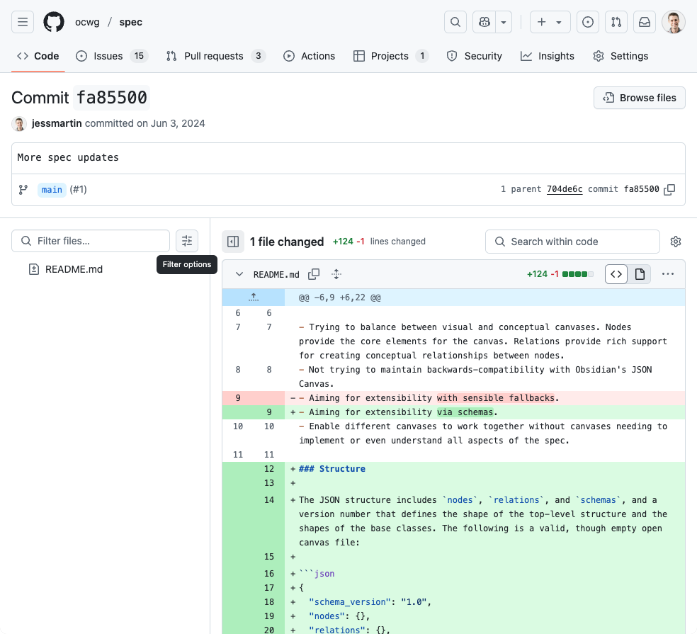

# The Last Mile of Local-First
## File Formats and the Final Ideals
#
### Jess Martin
### May 28, 2025
---
# Hi! I'm Jess Martin.

Find me online at:
[jessmart.in](https://jessmart.in)
[SocioTechnica.org](https://sociotechnica.org)
<!-- 
  - Applied researcher - bridging the gap from academic research to build real systems imbued with these qualities
  - Future of computing - app interoperability
  - Local-first software can enable this
    - a few problems yet to solve, which we'll talk about today
  - Worked on several local-first frameworks and apps over the last few years
      - Croquet
      - Fission's WebNative / OddSDK
      - Daylight Tablet's sync system
      - DXOS
  -->
  ---
# Today I'm going to talk about...

- A Last Mile problem for Local-first Software

<!--
First, I'll introduce and motivate this problem
But it would be worth you thinking in your own mind, before you know exactly what I'm going to suggest IS the last mile problem, what would YOU say it is?
-->
---
[localfirst.fm/landscape](http://localfirst.fm/landscape)

<!--
- My friend Johannes and I just finished working on this resource called Local-first Landscape
    - It's a blah blah blah
- Find it at https://localfirst.fm/landscape
-->
---
# 6-month deep dive into the local-first ecosystem

<!--
- In order to develop this resource, had to look at all of the systems that can be used to build local-first software and understand their capabilities
    - Worked on it for ~6 months
    - Reviewed dozens of systems
    - Talked to the creators of these systems
- I think that pretty well qualifies me to ... give a score to entire ecosystem
-->
---
# A Local-first Global Scorecard
How are we doing at building software that conforms to the local-first ideals?

<!--
- If you've read the original Local-first Software paper (I won't ask for a show of hands) then you may remember this scorecard being applied to different software
- What about the ecosystem as a whole?
- How are we doing at enabling software that maximally expresses the ideals?
- This isn't about a single piece of software or framework - I'm not here to crown any champions. It's about all of us.
-->

---
# A Local-first Scorecard
No spinners: 
Multi-device:
Network optional:
Seamless collaboration: 
Security and privacy by default:
You retain ownership & control:
The Long Now:
<!--
- Six years since the article was published... we have solved many tech challenges!
- (and even longer since Offline-first and some of the precursor work)
- Let's take a look at our progress on the Scorecard
-->

---
# A Local-first Scorecard
No spinners: ？
Multi-device:
Network optional:
Seamless collaboration: 
Security and privacy by default:
You retain ownership & control:
The Long Now:
<!--
- First off: No Spinners
- Software has gotten faster!
- Last year's conference was full of people bragging about how fast their software is.
- Good work!
--> 
---
# A Local-first Scorecard
No spinners: ✓
Multi-device: ？
Network optional: 
Seamless collaboration: 
Security and privacy by default:
You retain ownership & control:
The Long Now:
<!--
- Sync engines are amazing!
- Entire category devoted to solving this problem
- It's almost table stakes for many application categories
- Hard work spanning the web and mobile, but we're doing it!
-->

---
# A Local-first Scorecard
No spinners: ✓
Multi-device: ✓
Network optional: ？
Seamless collaboration: 
Security and privacy by default:
You retain ownership & control:
The Long Now:
<!--
- Still need a server or at least a sync server
- Still a lot of work to do to make P2P fully reliable and easy, but it's getting better
- Full offline support is possible! But until we have full P2P over bluetooth or some ad-hoc local networking in our software, I don't think we can give ourselves a full green check here
-->

---
# A Local-first Scorecard
No spinners: ✓
Multi-device: ✓
Network optional: –
Seamless collaboration: ？
Security and privacy by default:
You retain ownership & control:
The Long Now:
<!--
- Lots of hard work on CRDTs and other methods of reconciliation
- There are still cases where it's hard, but again, it's so good, it has become table stakes
- We need to extend seamless collaboration beyond coding and design tools, but the path has been laid - it's _possible_
    - Props to Ink & Switch for Jacquard
-->

---
# A Local-first Scorecard
No spinners: ✓
Multi-device: ✓
Network optional: –
Seamless collaboration: ✓
Security and privacy by default: ？
You retain ownership & control:
The Long Now:
<!--
- We're not quite there yet
    - See Brooklyn's talk
- Auth protocols still require a good deal of centralization and server authority.
-->

---
# A Local-first Scorecard
No spinners: ✓
Multi-device: ✓
Network optional: –
Seamless collaboration: ✓
Security and privacy by default: –
You retain ownership & control: ？
The Long Now: ？
<!--
What about these last two?
-->

---
# You retain ownership and control is about _agency_.
> [...] we mean ownership in the sense of **user agency, autonomy, and control over data.** You should be able to **copy and modify data in any way**, write down any thought, and **no company should restrict what you are allowed to do.**

> does not mean that the software must necessarily be open source. [...] it is possible for commercial and closed-source software to satisfy the local-first ideals, as long as it **does not artificially restrict what users can do with their files.**

### So, how are we doing at giving users agency?

---
# The Long Now

> When you do some work with local-first software, your work should **continue to be accessible indefinitely**, even after the company that produced the software is gone.

> **Some file formats (such as plain text, JPEG, and PDF) are so ubiquitous** that they will probably be readable for centuries to come.

> However, in order to read less common file formats and to preserve interactivity, you need to be able to run the original software (if necessary, in a virtual machine or emulator).

### How are we doing at enabling access indefinitely?

---
# Local-first Architecture
Here's an architecture diagram of what this looks like today:

<!--
Let's look at a high-level architecture for local-first software.
We're getting the data to the user's devices.
But it's still _trapped_ inside the applications.
-->

--- 
# A Local-first Scorecard
No spinners: ✓
Multi-device: ✓
Network optional: –
Seamless collaboration: ✓
Security and privacy by default: –
You retain ownership & control: Ｘ
The Long Now: Ｘ
<!--
- I have to give all of us an X on user ownership and control and the long now
- It's not clear to me that users have any more agency than they did five years ago or that our software is going to last longer
-->

---
[picture of telephone lines]
# The Last Mile Problem for Local-First Software
The Long Now and user-owned data are the _last miles_ of local-first software.

> The **last mile**, or **last kilometer**, in the [telecommunications](https://en.wikipedia.org/wiki/Telecommunications "Telecommunications"), [cable television](https://en.wikipedia.org/wiki/Cable_television "Cable television") and [internet](https://en.wikipedia.org/wiki/Internet "Internet") industries refers to the final leg of a [telecommunications network](https://en.wikipedia.org/wiki/Telecommunications_network "Telecommunications network") that delivers telecommunication services to retail [end-users](https://en.wikipedia.org/wiki/End-user "End-user") (customers).

> More specifically, _last mile_ describes the portion of the telecommunications network chain that **physically reaches the end-user's premises.**

<!--
We're getting the data onto the end-user's device, but not onto their "premises." 
They don't have the data somewhere they can **control.**
- We are getting the data all the way to the device, but not able to access it
- But just because data is on the device doesn't mean users can access it
- Especially if the data stays trapped in proprietary formats
-->

---
# App Developers: The Last Mile is _your_ problem!
Frameworks have done their part.
Time for **app developers** to step up!

<!--
- The last five years of advances have largely been solved by frameworks and libraries and a few intrepid software companies
- Pioneering, hard work!
- The "Last Mile" of local-first will have to be solved by application developers.
- This talk will be a challenge to app developers. I'm going to provide a set of levels to grade yourself on the support you provide to your users.
-->

---
# Last Mile Levels of Support
I'm going to give you three levels to self-assess:
- Level 1: Export to common formats
- Level 2: Continuous export
- Level 3: Bi-directional sync

---
# LEVEL 1: Export to common formats

## Provide export and import.
## Choose open formats appropriate to your app domain.
## Support "Copy As"
<!--
- Just choose open formats
  - markdown, CSV, etc → your app domain
    - So many available - and you don't have to choose just one!
- Support copy as - don't require downloading a file
- Doesn't _have_ to be a file if that workflow isn't most useful to your users
-->

---
# LEVEL 1: Export to common formats

## Q: What if there isn't a format? 
## A: Invent one and document it.

<!--
- People often throw up XKCD927 and then throw up their hands.
    - It's not a get out of jail free card!
- If there isn't a file format, come up with one and document it clearly.
    - People can adopt or implement if they want to.
--> 

---

# Sometimes you have to invent one...

first commit written at Local-first conf: https://github.com/ocwg/spec/commit/fa85500c785ccfc8ac146252867775cada48f9b9

<!--
- Sometimes, you have to invent one...
- Obsidian is well known for file > app
- Introduced a canvas feature - there's no file format
  - JSON Canvas
- At the time, Orion Reed and I were doing canvas work
- DXOS - TLDraw - Doing export to file work, interop, etc
- Tried JSON Canvas - found it was too limiting to express the TLDraw, and other, infinite canvases
-->
---
# Sometimes you have to invent one...
First commit written at Local-first Conf 2024

<!--
- Local-first Conf last year we wrote the version of a new spec & minimal implementation to handle many canvases
- Will come back to that story...
--> 
---
# LEVEL 2: Continuous export

## Continuous projection of the app's data to an external source

- Kanban.md demo
    - Re-project the data in another form
<!--
- Think of this as a continuous projection of the app's data to an external source
    - Every write in the app causes a re-render of the projection
    - Doesn't handle reads - just overwrites
- We already mentioned Obsidian
- Kanban.md demo
    - ![[Pasted image 20250520064502.png]]
-->
---
# LEVEL 2: Continuous export

## Doesn't have to be files!

Linear -> Google Sheets DEMO

<!--
- Doesn't have to be files!
- Linear → Google Sheets DEMO
- Build charts, run calculations, etc
--> 

--- 
# LEVEL 3: Bi-directional sync

## Continuous projection
## *And* read from the external source to update
<!--
- Much harder!
- Obsidian implements this via the file system 
- Kanban.md can write, too!
    - So satisfying to drag a card over!
-->

--- 
# LEVEL 3: Bi-directional sync

## Much harder!
## Substrate matters
- now we are back in the land of open research problems...

<!--
- But now we are back in the land of open research problems
    - Substrate matters...
        - File system? CLI agent? Desktop app?
        - Playbit, Seph Gentle's OS
    - Particularly challenging for real-time collaboration, as changes aren't automatically available as "diffs" or "patches"
        - And merging of offline edits
--> 

---
# LEVEL 3: Bi-directional sync

## Amazing things are possible if you do the work!

Obsidian Canvas <> TLDRaw demo, powered by OCIF

<!--
- But amazing things are possible if you do the work...
      - Show a Obsidian Canvas ⟷ TLDraw demo powered by OCIF
    - Collaborate _across_ applications!
- What is powering this?
-->
---
# How does this demo work?

- TLDraw <> OCIF
    - via websockets
- JSONCanvas <> OCIF
    - via the file system

---
# Story of a file format
- The real magic is OCIF itself
    - Convert both to/from OCIF rather than directly to each other

<!--
- So, resuming my story... we kept working on the infinite canvas file format...
    - Show original demo from March of last year - only for arrows and rectangles - today, full support!
- The Open Canvas Working Group met 25 times over the past year
    - Git issues
    - Input from 15 canvases
    - Spec versions
    - 3 implementations
    - New collaborators
- Original demo: https://x.com/OrionReedOne/status/1768292314802201087
-->
---
# As of today, OCIF is at Candidate Recommendation
- We are following the W3C process
- Candidate Recommendation means:
    - We feel the spec captures the majority of cases and is relatively complete and stable
    - And now it's ready to be implemented
        - Two app that have implemented already and we have a handful of demos
    - _But_ the spec will still change as we seek to incorporate feedback from implementers
        - Feel really good about the spec
- If you are working on a canvas, consider implementing import/export OCIF
    - You can implement in our "tools" package which will give users access
    - Through the CLI tool
    - And through the exporter website
<!--

-->

---
# Bonus! AI understands open formats
- A few quick demos of AI working with OCIF
    - AI explaining a canvas
    - AI writing a canvas based on a prompt, etc...

<!--
- Use the local TLDraw instance & the OCIF file watcher...
-->

---
# To wrap up...

- App developers will have take us the last mile..
- Reiterate Last mile story - show the phone lines again
- Show score card again
- Encourage us to give users control and solve for the Long Now!
